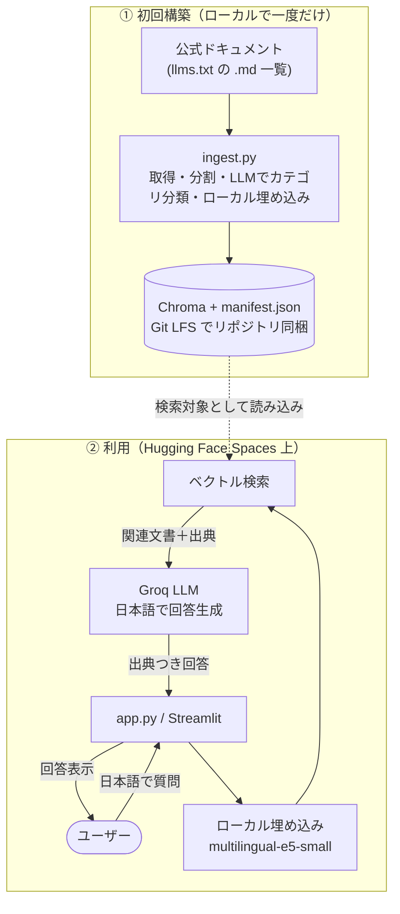

# 📚 Claude Code ドキュメント Q&A ボット

**Claude Code の公式ドキュメント（英語・約150ページ）を「日本語でいつでも質問できる先生」に変える RAG チャットボット。** 出典リンク付きで回答し、理解度クイズで復習までできます。

> 個人開発のポートフォリオです。**「AI を使ったプロダクトを、無料枠の制約の中で実際に作って公開する」**ことをテーマに、要件定義・データパイプライン・RAG 実装・UI・デプロイまで一人で通しで構築しました。

以下の 🔗 **デモ** のリンクで、実際にアプリを試すことができます。

|  | Link |
|--|--|
| 🔗 **デモ** | <https://huggingface.co/spaces/altair-nasubee/ai-docs-rag-bot> |
| 🔗 **ソース** | <https://github.com/altair-nasubee/ai-docs-rag-bot> |

---

## このアプリでできること

- **専門ドキュメントへ日本語で気軽に質問** — 英語の公式ドキュメントを根拠に、日本語で回答。
- **答えの根拠（出典リンク）を表示** — どのページに基づくか分かるので安心して確認できる。
- **分野が分からなくても使える** — 既定で全分野から自動検索。分野はドキュメント内容から自動分類され、説明・質問例つき。
- **理解度クイズで復習** — ドキュメントから自動生成した4択クイズで、学んだ内容をチェック。
- **スマホでも快適** — インストール不要、モバイル最適化済み。

## 📸 スクリーンショット

<table align="center">
  <tr>
    <td align="center"></td>
    <td align="center"></td>
  </tr>
  <tr>
    <td align="center"><sub>Q&A 画面</sub></td>
    <td align="center"><sub>クイズ画面</sub></td>
  </tr>
</table>

<!-- スクリーンショットは docs/screenshots/ に配置（ai-docs-rag-bot_1.png / _2.png）。 -->

---

## 主な機能

| 機能 | 内容 |
| --- | --- |
| 🔍 RAG 検索＋回答 | 質問に関連する箇所だけをベクトル検索し、LLM が日本語で回答。出典を併記。 |
| 🌐 クロスリンガル検索 | **日本語の質問で英語ドキュメントを検索**（多言語埋め込み）。 |
| 🏷️ 自動カテゴリ分類 | 取り込み時に LLM がドキュメントを日本語カテゴリへ自動分類（説明・質問例つき）。 |
| 📝 理解度クイズ | ドキュメントから4択クイズを事前生成。即時採点＋解説。 |
| 🔄 起動時の差分更新 | 公式の更新を検知し、変更ページだけ取り込み直す。 |
| 📱 モバイル最優先 UI | 下部固定チャット入力・セグメント切替ナビ・ダークテーマ。 |

---

## 技術スタック

| 区分 | 採用技術 |
| --- | --- |
| 言語 | Python 3.11 |
| フロント | Streamlit |
| RAG 連携 | LangChain |
| 回答生成 LLM | Groq `llama-3.3-70b-versatile`（無料枠） |
| 埋め込み（検索） | **ローカル ONNX** `intfloat/multilingual-e5-small`（fastembed・384次元・多言語） |
| ベクトルDB | Chroma |
| 取得 | requests（公式 `llms.txt` から `.md` を直接取得） |
| 公開 | Hugging Face Spaces（Docker・無料）／ Git LFS でDB同梱 |

---

## アーキテクチャ



「質問に関係する部分だけを検索して LLM に渡す」RAG 構成で、**速く・安く・根拠つき**に回答します。設計の詳細は [`docs/PLAN.md`](docs/PLAN.md) を参照。

---

## 💡 技術的な工夫・チャレンジ

実装中に直面した課題を、計測と切り分けで解決しました。

- **ランニングコストを実質ゼロに設計** — 当初クラウドの埋め込みAPI(Gemini)を使う設計だったが、**無料枠のレート制限(429)で初回ビルドが停止**。埋め込みを **ローカル ONNX モデル(fastembed)へ移行**し、APIキー・クォータ・レート制限を撤廃。**必要な API キーは Groq の1つだけ**に。
- **メモリ問題を計測で特定して解決** — 移行後、低メモリ環境でプロセスが約4.8GBまで膨張しスワップで停止。埋め込み単体・Chroma単体に**切り分けて計測**し、原因が fastembed の `batch_size`（活性化メモリを支配）と判明。`batch_size=8` で**ピーク約4GB→1.1GB**に削減し、1GB級の環境でも動く構成に。
- **検索品質の改善** — 「Claude Code とは何か」のような広く短い質問で関連ページが埋もれる現象を、取得件数の調整＋**「根拠から統合可・捏造不可」のプロンプト設計**で改善。
- **堅牢な取り込み** — 取得は一時エラー(502)をリトライ＋失敗ページはスキップ。取り込みは中断しても再開可能(resumable)。
- **デプロイの再現性** — 基準DBを **Git LFS** で同梱し、**Docker** でビルドして HF Spaces で公開。揮発性ファイルシステムでも安定動作する設計。

> ＝ **「動く」だけでなく、無料枠・メモリ・品質という現実の制約をエンジニアリングで乗り越えた**点が見どころです。

---

## ローカルでの実行

```bash
python3.11 -m venv .venv && source .venv/bin/activate
pip install -r requirements.txt
cp .env.example .env        # GROQ_API_KEY を設定（埋め込みはローカルのためキー不要）
python ingest.py --reset    # 基準ベクトルDBを構築（data/ に保存）
python gen_quiz.py          # クイズを生成（任意）
streamlit run app.py        # http://localhost:8501
```

## デプロイ

公開先は **Hugging Face Spaces**（Docker・CPU Basic・16GB・無料）。Secrets に `GROQ_API_KEY` を設定し、`data/` をリポジトリに同梱（`data/chroma` は Git LFS）。手順は [`docs/DEPLOY.md`](docs/DEPLOY.md) を参照。

---

## 公式ドキュメント更新時の `data/` 更新手順

Claude Code の公式ドキュメントが更新されたら、ローカルで基準データ（`data/`）を作り直してコミットします。**ローカル埋め込みなので追加コストはゼロ・数分で完了**します。

```bash
# 1. ベクトルDB（data/chroma + manifest.json）を全ページ再構築
python ingest.py --reset

# 2. クイズも作り直す（任意）
python gen_quiz.py

# 3. ローカルで表示を確認
streamlit run app.py

# 4. コミット＆ push（data/chroma は Git LFS で更新される）
git add data/manifest.json data/quiz.json data/chroma
git commit -m "docs: 公式ドキュメント更新を反映（基準DB再構築）"
git push space main        # 公開先(HF Spaces)へ反映。GitHub にも: git push origin main
```

> - **基準DBは必ず単一の `python ingest.py --reset` で作る**（取り込みは中断後の再開も可能だが、複数回に分けるとカテゴリ体系が混ざるため）。
> - 起動時の差分更新は「URL の追加・削除・1行説明の変化」までを自動追従します。`llms.txt` から検知できない**本文のみの変更**は、この再構築で反映します。
> - `data/llm_cache.db`（回答キャッシュ）はコミット対象外です。

---

## ライセンスと帰属

- 本リポジトリの **MIT ライセンスは、独自の実装コード**（`app.py` などのソース）に適用されます。
- `data/`（ベクトルDB・マニフェスト・クイズ）は **Claude Code 公式ドキュメント（© Anthropic）の内容に由来**します。本文の著作権は Anthropic に帰属し、MIT はこの派生コンテンツを再ライセンスするものではありません。回答には出典リンクを併記しています。

> Claude Code 公式ドキュメントを学習・参照目的で RAG により利用する非公式プロジェクトです。
