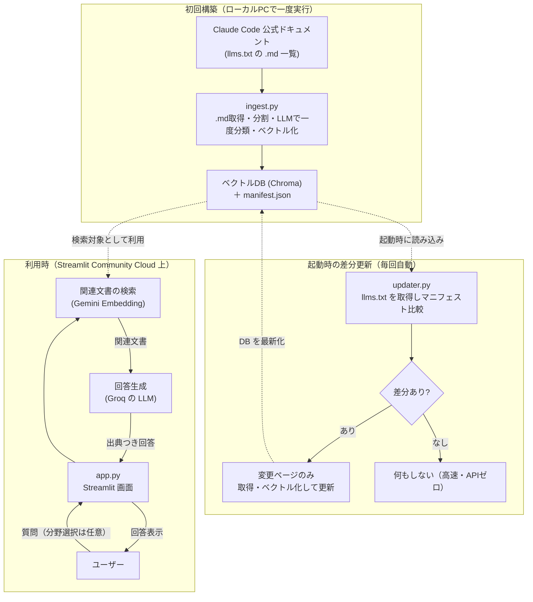

# Claude Code ドキュメント Q&A チャットボット 開発プラン

Claude Code の公式ドキュメントを「いつでも質問できる先生」に変えるチャットボットアプリです。
本ドキュメントは、エンジニアが実装に使うだけでなく、技術に詳しくない方が読んでも全体像をつかめるように整理しています。

---

## 1. このアプリでできること（非エンジニア向けサマリ）

Claude Code の公式ドキュメントは量が多く、必要な情報を探すのが大変です。
このアプリは、その公式ドキュメントを丸ごと読み込ませた「専門の相談員」として動きます。

- **カテゴリが分からなくても使える**: 既定では**全分野から自動で検索**するので、何も選ばずにそのまま質問できます。分野で絞りたい人だけ任意でカテゴリを選べます。カテゴリは固定ではなく、**取り込み時にドキュメントの内容から自動分類**して生成され、各カテゴリには説明と質問例が添えられます。回答には「参照した分野」も表示され、使ううちに分類が自然に分かります。
- **公式の最新ドキュメントに基づき日本語で回答**: 取り込み元は公式の英語ドキュメント（クリーンな Markdown）ですが、回答は日本語で生成します。
- **答えの根拠（出典リンク）を表示**: 回答がどのページに基づくかを示すので、安心して確認できます。
- **理解度チェッククイズ**: 学んだ内容を選択式クイズで確認できます。
- **自動で最新に追従**: アプリ起動時に公式ドキュメントの更新を自動チェックし、**変更があった部分だけ**を取り込み直します（差分更新）。
- **費用はほぼ無料**: 無料の AI サービス枠の範囲内で動かす設計です。差分更新により、最新化のための AI 利用も最小限に抑えます。
- **スマホでも使える**: iPhone などの Web ブラウザからインストール不要で利用できます。

### 一言でいうと
> 「Claude Code の分厚いマニュアルに、日本語で気軽に質問でき、根拠つきで答えてくれて、クイズで復習までできるアプリ」

---

## 2. 全体像（アーキテクチャ）

このアプリは「初回構築」「起動時の差分更新」「利用時」の3つの流れで動きます。

### 2-1. 初回構築（開発者がローカルで一度実行）
公式ドキュメントを集めて、AI が検索しやすい形（ベクトルDB）に変換し、リポジトリに同梱します。あわせて「どのページをいつ取り込んだか」「どんなカテゴリがあるか」の一覧（マニフェスト）を保存します。

### 2-2. 起動時の差分更新（アプリ起動・スリープ復帰のたびに自動）
起動時にまず公式の `llms.txt` だけを取得し、保存済みマニフェストと比較します。**新規・更新されたページだけ**を取り込み直すため、変更がなければ AI 利用ほぼゼロ・高速で、変更時だけ少量を更新します。これにより、スリープから復帰したときも自動で最新の内容になります。

### 2-3. 利用時（ユーザーが使うたび）
ユーザーの質問に関係しそうな部分だけをベクトルDBから探し出し、その内容をもとに AI が回答します。



### 2-4. なぜこの仕組み（RAG）なのか
AI に毎回マニュアル全文を読ませると遅く・高コストになります。
そこで「質問に関係する部分だけを検索して AI に渡す」方式（RAG: 検索拡張生成）を採用し、**速く・安く・正確に**回答できるようにしています。

---

## 3. 技術スタック

| 区分 | 採用技術 | 役割 | 費用 |
| --- | --- | --- | --- |
| 画面（フロント） | Streamlit | チャット画面・カテゴリ選択 UI | 無料 |
| 連携の土台 | LangChain | 検索〜回答生成の処理をつなぐ | 無料（OSS） |
| 回答生成 AI | Groq `llama-3.3-70b-versatile`（`ChatGroq`） | 質問への日本語回答を生成 | 無料枠 |
| 検索用 AI | Gemini `gemini-embedding-001`（768次元・多言語） | 文章を数値ベクトル化して検索 | 無料枠 |
| データベース | Chroma（ベクトルDB） | ドキュメントを検索可能な形で保存 | 無料（ローカル） |
| 取得 | requests | 公式 `.md` ドキュメントの取得（HTMLパース不要） | 無料（OSS） |
| 公開先 | Streamlit Community Cloud | アプリを Web に公開 | 無料 |

### 用語のかんたん説明
- **LLM（大規模言語モデル）**: 文章を理解して文章で答える AI。ここでは Groq を使用。
- **埋め込み（Embedding）モデル**: 文章を「意味を表す数値の並び」に変換する AI。意味が近い文章を検索するために使う。ここでは Gemini を使用。
- **ベクトルDB**: 上記の数値を保存し、「似た意味の文章」を高速に探せるデータベース。
- **RAG**: 検索（Retrieval）でみつけた情報を AI に渡して回答させる仕組み。

---

## 4. 設計方針・前提

- **完全無料枠で運用**: LLM は Groq 無料枠、Embedding は Gemini 無料 API。
- **使用モデルの既定と選定理由**:
  - **回答 LLM: Groq `llama-3.3-70b-versatile`**（安定の本番モデル・日本語回答が良好・128k コンテキストで RAG 向き）。`GROQ_MODEL` で切替可能。代替: 日本語重視なら `qwen3-32b`、高速/制限回避なら `llama-3.1-8b-instant`。preview 系（`kimi-k2` 等）は終了リスクがあり既定にしない。
  - **埋め込み: Gemini `gemini-embedding-001`、`output_dimensionality=768`**。100以上の言語に対応し、**日本語質問↔英語ドキュメントのクロスリンガル検索**に最適。768次元でメモリ/DBを節約。**3072未満のため取得ベクトルは手動でL2正規化が必要**。`task_type` は取り込み=`RETRIEVAL_DOCUMENT`、質問=`RETRIEVAL_QUERY`。LangChain では `GoogleGenerativeAIEmbeddings(model="models/gemini-embedding-001", ...)`。
- **無料枠の制約を設計に反映**:
  - Groq 無料枠は全モデル共通で **30 RPM / 6,000 TPM / 14,400 RPD・出力上限 8,192 トークン**。**6,000 TPM がボトルネック**なので、RAG の取得件数 **k は 4〜5 程度**に抑え、投入コンテキストを膨らませない。
  - Gemini 埋め込みの**入力上限は 2,048 トークン** → **チャンクサイズはそれ以内**（目安 ~1,000 トークン、オーバーラップ ~100〜150）。
  - 取り込み時の一括カテゴリ分類も 6,000 TPM 内に収まるよう、必要に応じてページを**バッチ分割**して LLM に渡す。
- **ローカル LLM は使わない**: 公開先の Streamlit Community Cloud はメモリ約 1GB・GPU なしのため、AI 推論はすべて API 経由にする。
- **秘密情報の管理**: API キーはコードに直書きせず、ローカルは `.env`、本番は `st.secrets` で管理。`.env` / `secrets.toml` はコミットしない。
- **API キーは開発者キーのみ（方式A）**: ユーザーごとに UI でキーを入力させる方式は採用しない（個人学習＋デモ用途で摩擦ゼロを優先）。すべての利用は開発者の無料枠を消費する前提とし、レート制限到達時はエラーメッセージで案内する。公開URLの乱用・枠枯渇が問題化した場合は、将来的に「任意でユーザーキーを入力するハイブリッド方式」を検討する（現時点では非対応）。
- **ドキュメント取得は公式インデックス利用**: HTML を総当たりせず、公式の `https://code.claude.com/docs/llms.txt` から URL 一覧を抽出。`llms.txt` は `## Docs` の下に約150件の **`.md` リンク＋1行説明がフラットに並ぶ**形式（トピック別のセクション見出しは無い）。各ページは `.md` を直接取得できるため **HTML パースは不要**（`requests` で取得）。
- **言語ソースは英語 `.md`・回答は日本語（B1）**: `llms.txt` のリンクは英語版（`/docs/en/....md`）。クリーンな Markdown をそのまま取り込み、回答プロンプトで「日本語で回答」を指示する。出典リンクは対応する公式ページ（必要に応じて `/docs/en/` 表示用 URL）を提示。
- **カテゴリは取り込み時に一度だけ LLM で自動分類（A2）**: `llms.txt` がフラットでセクション見出しが無いため、取り込み時に**全ページのタイトル＋説明をまとめて LLM に渡し、分かりやすい日本語カテゴリへ一括分類**する（オフラインで稀にしか実行しないため一度きりの少額コスト）。生成したカテゴリ一覧（説明・質問例つき）と各ページのカテゴリ割当を `data/manifest.json` に保存し、各チャンクのメタデータにも付与する。
  - **runtime（差分更新時）は LLM 分類を呼ばない**: 起動時に増えた新規ページは、既存カテゴリの代表ベクトルとの類似度で**最も近いカテゴリに自動割当**（追加 API・LLM なし）。カテゴリ体系自体の作り直しは、基準DBの再構築（ローカル/Actions）時にのみ行う。
- **カテゴリ未理解ユーザーへの配慮（重要）**: カテゴリ名だけでは中身が分からない人がいるため、以下を採用する。
  - **既定は「全体から検索」・カテゴリ選択は任意（案1）**: 何も選ばなくても全分野から検索して回答する。カテゴリは絞り込みたい人向けのオプション扱い。
  - **各カテゴリに説明と質問例を添える（案2）**: 「はじめに … インストールや初期設定。例: "Macで使い始めたい"」のように、名前だけで分からなくても中身が伝わるようにする。説明・質問例は**取り込み時のカテゴリ分類 LLM 呼び出しと同時に生成**して `manifest.json` に保持（runtime では生成しない）。
  - **質問から関連分野を自動推定して提示（案3）**: 検索のためにどのみち作る**質問ベクトルを再利用**し、各カテゴリの代表ベクトルとの類似度で「関連しそうな分野」を推定して表示（追加 API コストほぼゼロ）。あくまで提示のみで強制はしない。
  - **回答に「参照した分野」を表示（案4）**: 取得文書のカテゴリを回答に併記し、使ううちに分類を学べるようにする。
- **カテゴリ選択はメインエリアに配置**: iPhone などモバイルではサイドバーが初期状態で隠れて気づきにくいため、（任意の）カテゴリ選択は画面本体の上部に置く（サイドバーには置かない）。
- **最新化は「起動時の差分更新」方式（案A）**: 起動・スリープ復帰のたびに `llms.txt` を取得して保存済みマニフェストと比較し、**新規・削除・説明変更のページだけ**を再取り込み。フルクロールは行わない。
  - **検知粒度の制約**: `llms.txt` には各ページの更新日時・本文ハッシュが**含まれない**。そのため `llms.txt` だけで安価に分かるのは「URL の追加・削除」「1行説明の変化」まで。これを変更検知のトリガとし、対象ページのみ `.md` を取得して本文ハッシュを更新する。
  - **本文のみの更新（URL も説明も不変）**: `llms.txt` からは検知できないため、基準DBの定期再構築（ローカル/GitHub Actions で `ingest.py` 再実行 → `data/` を再コミット）でまとめて追従する。
  - 差分が無ければ取得・Embedding をスキップし、起動を高速かつ低コストに保つ。
  - 起動時処理は `@st.cache_resource` で1プロセス1回に限定し、毎リクエストでの再実行を防ぐ。
- **API 節約の工夫**:
  - Embedding は初回構築時と差分更新時のみ（通常の利用時は質問文のみ変換）。
  - カテゴリ分類の LLM 利用は**取り込み時の一度きり**（runtime では呼ばない＝新規ページは類似度で自動割当）。
  - 同じ質問は LLM キャッシュで再利用。
  - クイズは事前に一括生成して保存し、出題時は AI を呼ばない。

---

## 5. 作成するファイル一覧

| ファイル | 役割 |
| --- | --- |
| `requirements.txt` | 依存ライブラリ定義 |
| `.env.example` | 環境変数のサンプル（キー名のみ） |
| `.streamlit/secrets.toml` | 本番用シークレットの例（実体はコミットしない） |
| `.gitignore` | `.env` などを除外 |
| `config.py` | キー・モデル名・パスの一元管理（`.env` と `st.secrets` 両対応） |
| `ingest.py` | `.md` 取得 → 分割 → カテゴリ分類（取り込み時 LLM 1回）→ ベクトル化 → DB 保存（初回構築・差分更新の共通処理） |
| `updater.py` | 起動時の差分更新（`llms.txt` 比較 → 変更ページのみ `ingest` を呼ぶ） |
| `rag.py` | 検索 + プロンプト + Groq 回答生成のチェーン |
| `app.py` | Streamlit 画面（起動時に差分更新を実行・カテゴリ選択・チャット） |
| `gen_quiz.py` | クイズの事前一括生成（フェーズ2） |
| `data/` | ベクトルDB・`manifest.json`・クイズ JSON の保存先 |

---

## 6. 画面設計（UI/UX）

### 6-1. 基本方針（ユーザビリティ原則）
- **迷わせない**: 「（任意で分野を選び）質問する」の主動線を画面中央に置き、設定類のみサイドバーに退避。カテゴリ選択は任意で、選ばなくても質問できる。
- **モバイル最優先**: iPhone のブラウザ利用を前提に、サイドバーが隠れても操作が完結するようにする。主要操作（カテゴリ選択・質問入力）はメインエリアに置く。
- **空の状態で迷子にさせない**: 初回表示で使い方と質問例（クリックで入力）を提示。
- **待ち時間を不安にさせない**: コールドスタートや回答生成中は `st.spinner` で状態表示。
- **答えの信頼性を見せる**: 回答直下に出典リンクを必ず表示。
- **失敗時に親切**: レート制限・更新失敗はわかりやすいメッセージで案内。
- **色だけに依存しない**: 正誤などは記号＋文言で表す。

### 6-2. レイアウト（メインエリア中心）

```text
┌─────────────────────────────────────────────────────────┐
│  [💬 Q&A]  [📝 クイズ]        ← 上部タブ                │
├─────────────────────────────────────────────────────────┤
│  カテゴリ: ( 全体から検索 ▼ )  ← メインエリア上部に常時表示 │
│            ※llms.txt から自動生成・「全体から検索」も可   │
│  ─────────────────────────────────────────────────────  │
│  💬 会話履歴（吹き出し）                                 │
│    user: ...                                            │
│    ai:   回答 ...                                       │
│          └ 出典: [page title](url)                      │
│  ─────────────────────────────────────────────────────  │
│  [ ここに質問を入力 ________________ ]  (chat_input)     │
└────────────────────────────────────────────────────────┘

サイドバー（補助のみ・隠れてもOK）:
  ・アプリ説明 / 使い方
  ・ステータス（最終更新日時・使用モデル）
  ・会話をクリア
```

### 6-3. Q&A タブ
- **カテゴリ選択は任意**（既定は「全体から検索」）。メインエリア上部に `st.selectbox` を置き、選択肢は `manifest.json` のカテゴリ一覧から動的生成。先頭を「全体から検索（おすすめ）」にして、選ばなくても使えることを明示。
- **カテゴリの説明・質問例**: セレクトボックスの近くに `st.expander("各分野の説明と質問例")` を置き、`manifest.json` の説明・質問例を表示（質問例ボタンは押すと入力欄に投入）。
- **空の状態**: 「カテゴリは選ばなくてOK。何が知りたいですか?」＋代表的な質問例ボタン。
- **会話履歴**: `st.chat_message` で user/ai を吹き出し表示。
- **関連分野の自動提示（案3）**: 質問送信時、質問ベクトルとカテゴリ代表ベクトルの類似度から「関連しそうな分野」を `st.caption` で軽く提示（強制せず、絞り込みのヒントとして）。
- **参照した分野の表示（案4）**: 回答直下に、取得文書のカテゴリを「参照した分野: 環境構築」のように表示。
- **出典**: 回答直下に `st.caption` または `st.expander("出典")` でリンク列挙。
- **入力**: 最下部に `st.chat_input`（モバイルで固定表示）。
- **生成中**: `st.spinner("回答を生成中…")`、復帰直後は「最新ドキュメントを確認中…」。

### 6-4. クイズ タブ（フェーズ2）
- メインエリアでカテゴリ選択＋出題数選択＋「スタート」。
- **1問ずつ表示**（`st.radio`）→ 回答 → **即時に正誤（✓/✗＋文言）＋解説**。
- `st.progress` で進捗、最後にスコアと「もう一度」。

### 6-5. モバイル（iPhone ブラウザ）配慮
- サイドバーには重要操作を置かない（初期状態で折りたたまれるため）。
- `st.columns` の多用を避け、縦積みで成立させる。
- ボタン・ラジオはタップしやすいサイズ・間隔に。
- 横長要素（長い出典リスト等）は `st.expander` に収める。

---

## 7. 実装ステップ（順番に進める）

### フェーズ1: ドキュメント検索 Q&A ボット

#### STEP 1: プロジェクト初期化
- [ ] `requirements.txt` を作成（streamlit, langchain, langchain-groq, langchain-google-genai, langchain-community, langchain-chroma, langchain-text-splitters, chromadb, requests, python-dotenv）。※ `.md` を直接取得するため HTML パーサ（beautifulsoup4）は不要。
- [ ] `.env.example` を作成（`GROQ_API_KEY`, `GOOGLE_API_KEY`, `GROQ_MODEL`=既定 `llama-3.3-70b-versatile`, `EMBED_MODEL`=既定 `models/gemini-embedding-001`, `EMBED_DIM`=既定 `768`）。
- [ ] `.gitignore` を作成（`.env`, `.streamlit/secrets.toml` を除外）。
- [ ] `config.py` を作成（`os.getenv` と `st.secrets` の両対応でキー・モデル名・パスを返す）。
- [ ] 仮想環境を作り `pip install -r requirements.txt` で動作確認。

#### STEP 2: ドキュメント取り込み（`ingest.py`）
- [ ] `requests` で `https://code.claude.com/docs/llms.txt` を取得し、各行から **`.md` URL・タイトル・1行説明**を抽出（`## Docs` 配下のフラットなリスト）。
- [ ] 各 `.md` URL を `requests` で直接取得（クリーンな Markdown なので HTML パース不要）。本文ハッシュも算出。
- [ ] `RecursiveCharacterTextSplitter` で分割（**チャンク ~1,000 トークン以内**＝埋め込み入力上限 2,048 を超えない・オーバーラップ ~100〜150）。
- [ ] **全ページのタイトル＋説明をまとめて LLM に渡し、分かりやすい日本語カテゴリへ一括分類**（取り込み時の1回のみ・6,000 TPM 内に収まるよう必要ならバッチ分割）。同じ呼び出しで各カテゴリの**説明文と質問例**も生成。各ページにカテゴリを割当て、チャンクのメタデータに付与。
- [ ] Gemini `gemini-embedding-001`（`task_type=RETRIEVAL_DOCUMENT`, `output_dimensionality=768`, **L2正規化**）でベクトル化し、Chroma に永続化（`data/` に保存）。
- [ ] `data/manifest.json` に保存: 各 URL・本文ハッシュ・ページ→カテゴリ割当・**カテゴリ一覧（説明・質問例つき）**・**各カテゴリの代表ベクトル**（所属チャンク平均など）。
- [ ] 「指定 URL だけを取り込み/更新/削除する」関数として実装し、差分更新から再利用できるようにする。
- [ ] ローカルで実行し、`data/` にDBと `manifest.json` が生成されることを確認。

#### STEP 3: 起動時の差分更新（`updater.py`）
- [ ] `llms.txt` を取得し、最新の URL 一覧・各行の説明を算出。
- [ ] `data/manifest.json` と比較し、**URL の追加・削除・説明変更**を判定（本文のみの変更は llms.txt からは検知不可＝基準DB再構築で対応する旨をコメント）。
- [ ] 対象ページだけ `.md` を取得して再ベクトル化・DB更新。**新規ページのカテゴリは LLM を呼ばず、代表ベクトルとの類似度で最近傍カテゴリへ自動割当**。
- [ ] `manifest.json`（URL・ハッシュ・カテゴリ割当）を更新。
- [ ] 差分がなければ即座に終了（取得・Embedding を行わない）。
- [ ] レート制限・ネットワーク失敗時は更新をスキップし、既存DBで動作継続する（フェイルセーフ）。

#### STEP 4: 検索・回答チェーン（`rag.py`）
- [ ] Chroma を読み込み、**カテゴリ指定は任意**（未指定なら全体検索）の Retriever を構成（**取得件数 k は 4〜5**＝Groq 6,000 TPM に配慮）。質問の埋め込みは `task_type=RETRIEVAL_QUERY`・768次元・L2正規化で取り込み側と統一。
- [ ] 取得文書から**参照カテゴリと出典 URL を抽出して返す**（案4の表示用）。
- [ ] 質問ベクトルとカテゴリ代表ベクトルの類似度から**関連分野を推定する関数**を用意（案3、追加 API なし）。
- [ ] 回答プロンプトを作成（英語ドキュメントの内容のみを根拠に**日本語で回答**・出典 URL を併記）。
- [ ] `ChatGroq` を LLM に設定し、LCEL でチェーンを組む。
- [ ] `set_llm_cache`（SQLite 等）で同一質問のキャッシュを有効化。

#### STEP 5: 画面（`app.py`）
- [ ] 起動時に `updater.py` の差分更新を `@st.cache_resource` で1回だけ実行（毎リクエストで再実行しない）。
- [ ] 上部タブ（Q&A / クイズ）を構成。
- [ ] **メインエリア上部に任意のカテゴリ選択**（`manifest.json` から動的生成、先頭は「全体から検索（おすすめ）」）と、`st.expander("各分野の説明と質問例")` を配置。
- [ ] 「カテゴリは選ばなくてOK」と明示した上で、チャット UI（`st.chat_input` / `st.chat_message`）を実装。
- [ ] 質問送信 → `rag.py` のチェーンで回答 → **関連分野（案3）・参照した分野（案4）・出典リンク**つきで表示。
- [ ] サイドバーは補助情報（説明・ステータス・会話クリア）のみに限定。
- [ ] 会話履歴を `st.session_state` に保持。

#### STEP 6: 動作確認
- [ ] `streamlit run app.py` で起動し、差分更新が走ること（差分なし時はスキップ）、**カテゴリ未選択でも回答できること**、関連分野・参照分野・出典が表示されること、カテゴリが動的に出ることを確認。
- [ ] スマホ幅（ブラウザの開発者ツール）でカテゴリ・入力が使いやすいか確認。

### フェーズ2: 理解度クイズ機能

#### STEP 7: クイズ生成（`gen_quiz.py`）
- [ ] 取り込み済みドキュメントから選択式クイズ（問題 / 選択肢 / 正解 / 解説）を一括生成。
- [ ] `data/quiz.json` に保存（AI 呼び出しはこの生成時のみ）。

#### STEP 8: クイズ画面（`app.py` に追加）
- [ ] クイズタブを追加し、カテゴリ選択 → `quiz.json` から出題。
- [ ] 採点と解説表示を実装（出題時は AI を呼ばない）。

### フェーズ3: 公開（Streamlit Community Cloud）

#### STEP 9: デプロイ
- [ ] 公開 GitHub リポジトリを用意（`data/` のベクトルDBと `manifest.json` を同梱）。
- [ ] Community Cloud で `app.py` を指定してデプロイ。
- [ ] `st.secrets` に `GROQ_API_KEY` / `GOOGLE_API_KEY` を登録。
- [ ] メモリ約 1GB に収まることを確認（重い依存を入れない）。
- [ ] スリープ復帰時に差分更新が走り、最新ドキュメントで回答できることを確認。
- [ ] iPhone の実機ブラウザで表示・操作を確認。

---

## 8. 留意点・リスク

- **Community Cloud はスリープする**: 無料枠は一定期間アクセスがないと休眠し、再アクセス時に数十秒かけて再起動（コールドスタート）する。常時稼働ではない。
  - 会話履歴などメモリ上の状態は再起動で消える（`st.session_state` はセッション単位のため許容）。
  - 復帰のたびに「起動時の差分更新」が走るので、起き上がった時点で自動的に最新ドキュメントになる。
- **【重要】Community Cloud のファイルシステムは揮発性**: コールドスタートのたびにコンテナは **git にコミットされた状態へ戻り、実行中に書き込んだ差分（更新後の Chroma / `manifest.json`）は永続しない**。
  - 起動時の差分更新で書き込んだ内容は、そのプロセスが生きている間だけ有効。次のコールドスタートでは再び git の基準状態から差分判定が走る。
  - そのため、ドキュメントが更新されている期間は**コールドスタートごとに同じ再Embeddingが繰り返される**点に注意（無料枠を余分に消費しうる）。
  - 緩和策: 基準となるリポジトリ同梱DBを定期的に作り直してコミットする（手動 or GitHub Actions の定期実行で `ingest.py` を回し `data/` を更新）。これにより差分が小さく保たれ、繰り返し再Embedding を最小化できる。
- **差分更新のコスト管理**: 通常は差分なしで高速・APIゼロ。差分が出たときだけ少量の取得・Embedding が走る。フルクロールはしない。上記の揮発性をふまえ、基準DBの定期コミットと併用する。
- **無料枠のレート制限**: Groq / Gemini の毎分・1日上限に達した場合に備え、簡易なエラーメッセージ表示を入れる。差分更新が失敗しても既存DBで動作継続する。
- **スクレイピングの安定性**: 公式の `llms.txt` を使うことでHTML構造変更の影響を最小化。
- **メモリ（約1GB）への配慮**: `chromadb` は比較的重いので、取り込み件数が増えてメモリが厳しい場合は、より軽量な FAISS（`faiss-cpu`）への切り替えも選択肢にする。
- **秘密情報の保護**: `.env` / `secrets.toml` の実体は絶対にコミットしない。

---

## 9. 補足: RAG で使う2種類の AI モデル

- **埋め込みモデル（Gemini）**: 文章をベクトルに変換し、意味の近さで検索するために使う（文章は生成しない）。
- **チャット / LLM モデル（Groq）**: 検索した文書と質問を読み、自然言語の回答を生成する。
- Groq はチャット LLM のみ提供し Embedding API を持たないため、埋め込みは Gemini 側で用意する。両者がそろって初めて RAG が成立する。
