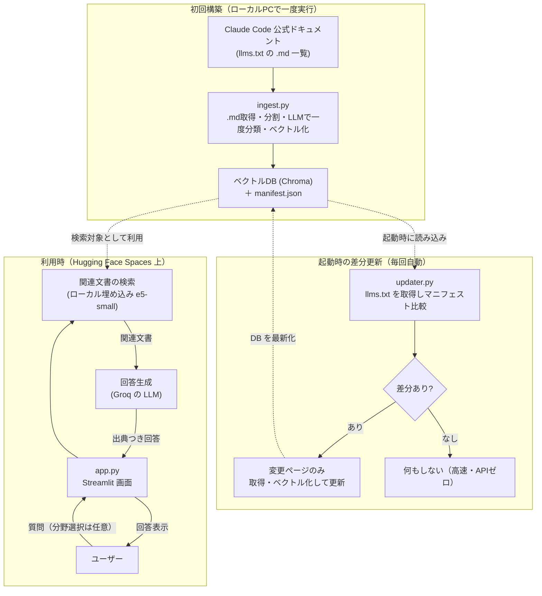

# Claude Code ドキュメント Q&A チャットボット 開発プラン

Claude Code の公式ドキュメントを「いつでも質問できる先生」に変えるチャットボットアプリです。
本ドキュメントは、エンジニアが実装に使うだけでなく、技術に詳しくない方が読んでも全体像をつかめるように整理しています。

---

## 1. このアプリでできること（非エンジニア向けサマリ）

Claude Code の公式ドキュメントは量が多く、必要な情報を探すのが大変です。
このアプリは、その公式ドキュメントを丸ごと読み込ませた「専門の相談員」として動きます。

- **カテゴリが分からなくても使える**: 既定では**全分野から自動で検索**するので、何も選ばずにそのまま質問できます。分野で絞りたい人だけ任意でカテゴリを選べます。カテゴリは固定ではなく、**取り込み時にドキュメントの内容から自動分類**して生成され、各カテゴリには説明と質問例が添えられます。回答には「参照した分野」も表示され、使ううちに分類が自然に分かります。
- **公式の最新ドキュメントに基づき日本語で回答**: 取り込み元は公式の英語ドキュメント（クリーンな Markdown）ですが、回答は日本語で生成します。
- **答えの根拠（出典リンク）を表示**: 回答がどのページに基づくかを示すので、安心して確認できます。
- **理解度チェッククイズ**: 学んだ内容を選択式クイズで確認できます。
- **自動で最新に追従**: アプリ起動時に公式ドキュメントの更新を自動チェックし、**変更があった部分だけ**を取り込み直します（差分更新）。
- **費用はほぼ無料**: 無料の AI サービス枠の範囲内で動かす設計です。差分更新により、最新化のための AI 利用も最小限に抑えます。
- **スマホでも使える**: iPhone などの Web ブラウザからインストール不要で利用できます。

### 一言でいうと

> 「Claude Code の分厚いマニュアルに、日本語で気軽に質問でき、根拠つきで答えてくれて、クイズで復習までできるアプリ」

---

## 2. 全体像（アーキテクチャ）

このアプリは「初回構築」「起動時の差分更新」「利用時」の3つの流れで動きます。

### 2-1. 初回構築（開発者がローカルで一度実行）

公式ドキュメントを集めて、AI が検索しやすい形（ベクトルDB）に変換し、リポジトリに同梱します。あわせて「どのページをいつ取り込んだか」「どんなカテゴリがあるか」の一覧（マニフェスト）を保存します。

### 2-2. 起動時の差分更新（アプリ起動・スリープ復帰のたびに自動）

起動時にまず公式の `llms.txt` だけを取得し、保存済みマニフェストと比較します。**新規・更新されたページだけ**を取り込み直すため、変更がなければ AI 利用ほぼゼロ・高速で、変更時だけ少量を更新します。これにより、スリープから復帰したときも自動で最新の内容になります。

### 2-3. 利用時（ユーザーが使うたび）

ユーザーの質問に関係しそうな部分だけをベクトルDBから探し出し、その内容をもとに AI が回答します。




### 2-4. なぜこの仕組み（RAG）なのか

AI に毎回マニュアル全文を読ませると遅く・高コストになります。
そこで「質問に関係する部分だけを検索して AI に渡す」方式（RAG: 検索拡張生成）を採用し、**速く・安く・正確に**回答できるようにしています。

---

## 3. 技術スタック


| 区分           | 採用技術                                                            | 役割                            | 費用                 |
| ------------ | --------------------------------------------------------------- | ----------------------------- | ------------------ |
| 画面（フロント）     | Streamlit                                                       | チャット画面・カテゴリ選択 UI              | 無料                 |
| 連携の土台        | LangChain                                                       | 検索〜回答生成の処理をつなぐ                | 無料（OSS）            |
| 回答生成 AI      | Groq `llama-3.3-70b-versatile`（`ChatGroq`）                      | 質問への日本語回答を生成                  | 無料枠                |
| 検索用 AI（埋め込み） | ローカル ONNX `intfloat/multilingual-e5-small`（fastembed・384次元・多言語） | 文章を数値ベクトル化して検索                | 無料（ローカル・キー/クォータ不要） |
| データベース       | Chroma（ベクトルDB）                                                  | ドキュメントを検索可能な形で保存              | 無料（ローカル）           |
| 取得           | requests                                                        | 公式 `.md` ドキュメントの取得（HTMLパース不要） | 無料（OSS）            |
| 公開先          | **Hugging Face Spaces**（CPU Basic・16GB・Streamlit SDK）            | アプリを Web に公開                  | 無料                 |


### 用語のかんたん説明

- **LLM（大規模言語モデル）**: 文章を理解して文章で答える AI。ここでは Groq を使用。
- **埋め込み（Embedding）モデル**: 文章を「意味を表す数値の並び」に変換する AI。意味が近い文章を検索するために使う。ここではローカル ONNX の多言語小型モデル（fastembed）を使用。
- **ベクトルDB**: 上記の数値を保存し、「似た意味の文章」を高速に探せるデータベース。
- **RAG**: 検索（Retrieval）でみつけた情報を AI に渡して回答させる仕組み。

---

## 4. 設計方針・前提

- **完全無料枠で運用**: LLM は Groq 無料枠、埋め込みは**ローカル ONNX（無料・キー/クォータ不要）**。
- **使用モデルの既定と選定理由**:
  - **回答 LLM: Groq `llama-3.3-70b-versatile`**（安定の本番モデル・日本語回答が良好・128k コンテキストで RAG 向き）。`GROQ_MODEL` で切替可能。代替: 日本語重視なら `qwen3-32b`、高速/制限回避なら `llama-3.1-8b-instant`。preview 系（`kimi-k2` 等）は終了リスクがあり既定にしない。
  - **埋め込み: ローカル ONNX `intfloat/multilingual-e5-small`（fastembed・384次元）**。100以上の言語に対応し、**日本語質問↔英語ドキュメントのクロスリンガル検索**に最適。**API キー・クォータ・レート制限が無く**、Gemini 無料枠の 429 で初回ビルドが詰まる問題を根治。onnxruntime は chromadb 依存で同梱済み。e5 系は取り込み=`passage:` 、質問=`query:`  のプレフィックスが必須で、取得ベクトルは L2 正規化する。`EMBED_MODEL` で切替可能（例: プレフィックス不要の `paraphrase-multilingual-MiniLM-L12-v2`）。
    - **（旧案）Gemini `gemini-embedding-001`（768次元）**: クロスリンガルは良好だったが、無料枠の埋め込みクォータ（毎分100・日次上限）が初回フルビルドの律速になり断念。
- **無料枠の制約を設計に反映**:
  - Groq 無料枠は全モデル共通で **30 RPM / 6,000 TPM / 14,400 RPD・出力上限 8,192 トークン**。取得件数は当初 k=4〜5 を想定したが、「Claude Code とは何か」のような**広く短い質問では関連ページが上位に集まりにくく回答が痩せる**ため、**実装は k=8**（チャンク1,500文字×8≒3,000トークンで 6,000 TPM 内）に設定。
  - e5-small の**入力上限は 512 トークン** → **チャンクサイズはそれ以内**（実装は ~~1,500 文字＝~~375トークン、オーバーラップ 200）。
  - **埋め込みのメモリは `batch_size` に支配される**: fastembed 既定 256 だと onnxruntime の活性化メモリが ~4GB に急増し低メモリ環境で OOM する。`EMBED_BATCH_SIZE=8` でピーク ~1.1GB に抑える。
  - 取り込み時の一括カテゴリ分類は Groq を使うため、6,000 TPM 内に収まるよう必要に応じてページを**バッチ分割**して LLM に渡す。
- **ローカル LLM（回答生成）は使わない**: 公開先はメモリが限られ GPU も無いため、**回答生成**は API（Groq）経由にする。一方、**埋め込みは小型モデル（数百MB・CPU可）なのでローカル実行**する（生成 LLM とは別カテゴリ）。
- **公開先は Hugging Face Spaces に決定**（CPU Basic・**16GB RAM**・Streamlit SDK・無料）。e5-small はモデル底値 ~930MB のため 1GB の Streamlit Community Cloud では際どく、メモリ余裕のある HF Spaces を採用。HF はシークレットを環境変数として渡すため `config.py` の `os.getenv` がそのまま動く。揮発性FS・48時間スリープあり。
- **秘密情報の管理**: API キーはコードに直書きせず、ローカルは `.env`、本番は `st.secrets` で管理。`.env` / `secrets.toml` はコミットしない。
- **API キーは開発者キーのみ（方式A）**: ユーザーごとに UI でキーを入力させる方式は採用しない（個人学習＋デモ用途で摩擦ゼロを優先）。すべての利用は開発者の無料枠を消費する前提とし、レート制限到達時はエラーメッセージで案内する。公開URLの乱用・枠枯渇が問題化した場合は、将来的に「任意でユーザーキーを入力するハイブリッド方式」を検討する（現時点では非対応）。
- **ドキュメント取得は公式インデックス利用**: HTML を総当たりせず、公式の `https://code.claude.com/docs/llms.txt` から URL 一覧を抽出。`llms.txt` は `## Docs` の下に約150件の `**.md` リンク＋1行説明がフラットに並ぶ**形式（トピック別のセクション見出しは無い）。各ページは `.md` を直接取得できるため **HTML パースは不要**（`requests` で取得）。
- **言語ソースは英語 `.md`・回答は日本語（B1）**: `llms.txt` のリンクは英語版（`/docs/en/....md`）。クリーンな Markdown をそのまま取り込み、回答プロンプトで「日本語で回答」を指示する。**出典リンクは表示用に `.md` を外し `/docs/en/` → `/docs/ja/` の日本語 HTML ページへ変換**して提示（`rag.py` の `_display_url`）。
- **回答プロンプトは「統合可・捏造不可」**: 厳格すぎると基本的な質問でも「記載なし」となるため、「参考ドキュメントから読み取れる範囲で統合して答える。無い事実は創作せず、本当に情報が皆無のときだけ『情報が見つかりませんでした』」とする。
- **カテゴリは取り込み時に一度だけ LLM で自動分類（A2）**: `llms.txt` がフラットでセクション見出しが無いため、取り込み時に**全ページのタイトル＋説明をまとめて LLM に渡し、分かりやすい日本語カテゴリへ一括分類**する（オフラインで稀にしか実行しないため一度きりの少額コスト）。生成したカテゴリ一覧（説明・質問例つき）と各ページのカテゴリ割当を `data/manifest.json` に保存し、各チャンクのメタデータにも付与する。
  - **catch-all カテゴリを作らせない（恒久対策）**: 分類プロンプトで「『その他/Other/Miscellaneous』のような漠然とした受け皿カテゴリは作らない」と明示し、生成後も `_is_catchall` で保険的に除外する。回答不能になりがちな「その他」を排除する。
  - **runtime（差分更新時）は LLM 分類を呼ばない**: 起動時に増えた新規ページは、既存カテゴリの代表ベクトルとの類似度で**最も近いカテゴリに自動割当**（追加 API・LLM なし）。カテゴリ体系自体の作り直しは、基準DBの再構築（ローカル/Actions）時にのみ行う。
- **カテゴリ未理解ユーザーへの配慮（重要）**: カテゴリ名だけでは中身が分からない人がいるため、以下を採用する。
  - **既定は「全体から検索」・カテゴリ選択は任意（案1）**: 何も選ばなくても全分野から検索して回答する。カテゴリは絞り込みたい人向けのオプション扱い。
  - **各カテゴリに説明と質問例を添える（案2）**: 「はじめに … インストールや初期設定。例: "Macで使い始めたい"」のように、名前だけで分からなくても中身が伝わるようにする。説明・質問例は**取り込み時のカテゴリ分類 LLM 呼び出しと同時に生成**して `manifest.json` に保持（runtime では生成しない）。
  - **質問から関連分野を自動推定して提示（案3）**: 検索のためにどのみち作る**質問ベクトルを再利用**し、各カテゴリの代表ベクトルとの類似度で「関連しそうな分野」を推定して表示（追加 API コストほぼゼロ）。あくまで提示のみで強制はしない。
  - **回答に「参照した分野」を表示（案4）**: 取得文書のカテゴリを回答に併記し、使ううちに分類を学べるようにする。
- **カテゴリ選択はメインエリアに配置**: iPhone などモバイルではサイドバーが初期状態で隠れて気づきにくいため、（任意の）カテゴリ選択は画面本体の上部に置く（サイドバーには置かない）。
- **最新化は「起動時の差分更新」方式（案A）**: 起動・スリープ復帰のたびに `llms.txt` を取得して保存済みマニフェストと比較し、**新規・削除・説明変更のページだけ**を再取り込み。フルクロールは行わない。
  - **検知粒度の制約**: `llms.txt` には各ページの更新日時・本文ハッシュが**含まれない**。そのため `llms.txt` だけで安価に分かるのは「URL の追加・削除」「1行説明の変化」まで。これを変更検知のトリガとし、対象ページのみ `.md` を取得して本文ハッシュを更新する。
  - **本文のみの更新（URL も説明も不変）**: `llms.txt` からは検知できないため、基準DBの定期再構築（ローカル/GitHub Actions で `ingest.py` 再実行 → `data/` を再コミット）でまとめて追従する。
  - 差分が無ければ取得・Embedding をスキップし、起動を高速かつ低コストに保つ。
  - 起動時処理は `@st.cache_resource` で1プロセス1回に限定し、毎リクエストでの再実行を防ぐ。
- **API 節約の工夫**:
  - Embedding は初回構築時と差分更新時のみ（通常の利用時は質問文のみ変換）。
  - カテゴリ分類の LLM 利用は**取り込み時の一度きり**（runtime では呼ばない＝新規ページは類似度で自動割当）。
  - 同じ質問は LLM キャッシュで再利用。
  - クイズは事前に一括生成して保存し、出題時は AI を呼ばない。

---

## 5. 作成するファイル一覧


| ファイル                      | 役割                                                                                                                 |
| ------------------------- | ------------------------------------------------------------------------------------------------------------------ |
| `requirements.txt`        | 依存ライブラリ定義                                                                                                          |
| `.env.example`            | 環境変数のサンプル（キー名のみ）                                                                                                   |
| `.streamlit/config.toml`（テーマ）/ `.streamlit/secrets.toml.example` | 本番用シークレットの例＋テーマ設定（secrets実体はコミットしない）                                                                                            |
| `.gitignore`              | `.env` などを除外                                                                                                       |
| `config.py`               | キー・モデル名・パスの一元管理（`.env` と `st.secrets` 両対応）                                                                         |
| `embedding.py`            | ローカル ONNX 埋め込みの共有ラッパー（fastembed・プレフィックス・L2正規化・`batch_size` 制御・モデルのシングルトン共有）。`ingest.py`/`rag.py`/`updater.py` が再利用 |
| `ingest.py`               | `.md` 取得 → 分割 → カテゴリ分類（取り込み時 LLM 1回）→ ベクトル化 → DB 保存（初回構築・差分更新の共通処理）                                                |
| `updater.py`              | 起動時の差分更新（`llms.txt` 比較 → 変更ページのみ `ingest` を呼ぶ）                                                                     |
| `rag.py`                  | 検索 + プロンプト + Groq 回答生成のチェーン                                                                                        |
| `app.py`                  | Streamlit 画面（起動時に差分更新を実行・カテゴリ選択・チャット）                                                                              |
| `gen_quiz.py`             | クイズの事前一括生成（フェーズ2）                                                                                                  |
| `data/`                   | ベクトルDB・`manifest.json`・クイズ JSON の保存先                                                                               |


---

## 6. 画面設計（UI/UX）

### 6-1. 基本方針（ユーザビリティ原則）

- **迷わせない**: 「（任意で分野を選び）質問する」の主動線を画面中央に置き、補助情報は「ℹ️ 情報」ビューに退避。カテゴリ選択は任意で、選ばなくても質問できる。
- **モバイル最優先**: iPhone のブラウザ利用を前提に、**サイドバーは使わず**主要操作・補助情報をすべてメインエリア（セグメント切替の各ビュー）に置く。
- **空の状態で迷子にさせない**: 初回表示で使い方と質問例（クリックで入力）を提示。
- **待ち時間を不安にさせない**: コールドスタートや回答生成中は `st.spinner` で状態表示。
- **答えの信頼性を見せる**: 回答直下に出典リンクを必ず表示。
- **失敗時に親切**: レート制限・更新失敗はわかりやすいメッセージで案内。
- **色だけに依存しない**: 正誤などは記号＋文言で表す。

### 6-2. レイアウト（メインエリア中心）

```text
┌─────────────────────────────────────────────────────────┐
│  ( 💬 Q&A )( 📝 クイズ )( ℹ️ 情報 ) ← segmented_control   │
├─────────────────────────────────────────────────────────┤
│  カテゴリ: ( 全体から検索 ▼ )  ← メインエリア上部に常時表示 │
│            ※manifest から動的生成・「全体から検索」も可   │
│  ─────────────────────────────────────────────────────  │
│  💬 会話履歴（吹き出し）                                 │
│    user: ...                                            │
│    ai:   回答 ...                                       │
│          └ 出典: [page title](ja の HTMLページ)         │
│  ─────────────────────────────────────────────────────  │
│  [ ここに質問を入力 ________________ ]  (chat_input・下部固定) │
└────────────────────────────────────────────────────────┘

ℹ️ 情報ビュー（補助・サイドバーは廃止）:
  ・アプリ説明 / 使い方
  ・ステータス（基準DB構築日時・使用モデル・差分更新状態）
  ・会話をクリア
```

### 6-3. Q&A ビュー

- **カテゴリ選択は任意**（既定は「全体から検索」）。メインエリア上部に `st.selectbox` を置き、選択肢は `manifest.json` のカテゴリ一覧から動的生成。先頭を「全体から検索（おすすめ）」にして、選ばなくても使えることを明示。
- **カテゴリの説明・質問例**: セレクトボックスの近くに `st.expander("各分野の説明と質問例")` を置き、`manifest.json` の説明・質問例を表示（質問例ボタンは押すと入力欄に投入）。
- **空の状態**: 「カテゴリは選ばなくてOK。何が知りたいですか?」＋代表的な質問例ボタン。
- **会話履歴**: `st.chat_message` で user/ai を吹き出し表示。
- **関連分野の自動提示（案3）**: 質問送信時、質問ベクトルとカテゴリ代表ベクトルの類似度から「関連しそうな分野」を `st.caption` で軽く提示（強制せず、絞り込みのヒントとして）。
- **参照した分野の表示（案4）**: 回答直下に、取得文書のカテゴリを「参照した分野: 環境構築」のように表示。
- **出典**: 回答直下に `st.caption` または `st.expander("出典")` でリンク列挙。
- **入力**: 最下部に `st.chat_input`（モバイルで固定表示）。
- **生成中**: `st.spinner("回答を生成中…")`、復帰直後は「最新ドキュメントを確認中…」。

### 6-4. クイズ ビュー（フェーズ2・実装済み）

- メインエリアで分野選択＋出題数スライダー＋「スタート」。`data/quiz.json` から `random.sample` で出題。
- **1問ずつ表示**（`st.radio`・初期未選択）→「回答する」→ **即時に正誤（✓/✗＋正解＋文言）＋解説**。
- `st.progress` で進捗、最後にスコアと「もう一度」。出題時は AI を呼ばない。

### 6-5. モバイル（iPhone ブラウザ）配慮

- サイドバーは使わない（モバイルで隠れる＆既定折りたたみが Streamlit バグで効かないため、補助情報も「情報」ビューへ）。
- `st.columns` の多用を避け、縦積みで成立させる。
- ボタン・ラジオはタップしやすいサイズ・間隔に。
- 横長要素（長い出典リスト等）は `st.expander` に収める。

---

## 7. 実装ステップ（順番に進める）

### 実装状況（再開用メモ・2026-06-24 時点）

- **フェーズ1・2 は実装＆動作確認まで完了**。残るは**フェーズ3（デプロイ）**のみ。**公開先は Hugging Face Spaces に決定**。
- **埋め込みは Gemini → ローカル ONNX（fastembed `intfloat/multilingual-e5-small`・384次元）に移行済み**（`embedding.py` の `LocalEmbeddings`: カスタム登録・`query:`/`passage:` プレフィックス・L2正規化・`batch_size` 制御）。`langchain-google-genai` 撤去・`fastembed` 追加。`GOOGLE_API_KEY` 不要。
- **メモリ対策（重要）**: fastembed 既定 `batch_size=256` は onnxruntime 活性化メモリが ~4GB に急増し低メモリ機で OOM する。`EMBED_BATCH_SIZE=8` でピーク ~1.1GB に抑制。モデルロード底値 ~930MB のため HF Spaces(16GB) を採用。
- **基準DB構築完了**: `python ingest.py --reset` で 150ページ / 約4,356チャンク / **12カテゴリ**（「その他」は除去済み・Glossary は「はじめに」へ再割当て）。`ingest.py` は resumable だが**複数回再開はタクソノミ混在を招く**ため正準DBは単一 `--reset` 実行で作る。`gen_quiz.py` で **48問**のクイズも生成済み（`data/quiz.json`）。
- **UI 調整済み**: ナビは `st.tabs` → **`st.segmented_control`（💬 Q&A / 📝 クイズ / ℹ️ 情報）**。サイドバーは廃止し補助情報は「情報」ビューへ。チャット入力は**画面下部固定**（Q&Aビューのみ）。テーマは `.streamlit/config.toml`（dark＋水色アクセント）。出典は**日本語 HTMLページ（/docs/ja/）**へリンク。**k=8 ＋緩和プロンプト**で広く短い質問にも回答。
- **データ運用**: `data/chroma`（54MB）は **Git LFS**（`git lfs track "data/chroma/**"`）。`manifest.json` / `quiz.json` は通常 git。`data/llm_cache.db` は除外。
- **解消した保留事項**: 旧「実行時埋め込みのフェイルファスト化（案A/B）」は、埋め込みローカル化で不要に。
- **次（フェーズ3）**: HF Spaces へデプロイ（push はユーザーが実施予定）→ スマホ実機確認。

### フェーズ1: ドキュメント検索 Q&A ボット

#### STEP 1: プロジェクト初期化 ✅ 完了

- [x] `requirements.txt` を作成（streamlit, langchain, langchain-groq, langchain-google-genai, langchain-community, langchain-chroma, langchain-text-splitters, chromadb, requests, python-dotenv）。※ `.md` を直接取得するため HTML パーサ（beautifulsoup4）は不要。
- [x] `.env.example` を作成（最終形は `GROQ_API_KEY`, `GROQ_MODEL`=既定 `llama-3.3-70b-versatile`, `EMBED_MODEL`=既定 `intfloat/multilingual-e5-small`, `EMBED_DIM`=既定 `384`。埋め込みはローカルのため `GOOGLE_API_KEY` は不要）。
- [x] `.gitignore` を作成（`.env`, `.streamlit/secrets.toml` を除外）。※ 既存の Python 用 `.gitignore` に該当除外あり。`.streamlit/secrets.toml.example` も追加。
- [x] `config.py` を作成（`os.getenv` と `st.secrets` の両対応でキー・モデル名・パスを返す）。`EMBED_BATCH_SIZE`・`RETRIEVAL_K`・プレフィックス等も集約（旧 Gemini throttle 用設定は撤去）。
- [x] 仮想環境を作り `pip install -r requirements.txt` で動作確認（Python 3.11.15・streamlit 1.58.0 等インストール済み）。

#### STEP 2: ドキュメント取り込み（`ingest.py`）✅ 完了（基準DB構築済み・150ページ/4,356チャンク/13カテゴリ）

- [x] `requests` で `https://code.claude.com/docs/llms.txt` を取得し、各行から `**.md` URL・タイトル・1行説明**を抽出（`## Docs` 配下のフラットなリスト）。
- [x] 各 `.md` URL を `requests` で直接取得（クリーンな Markdown なので HTML パース不要）。本文ハッシュ（sha256）も算出。
- [x] `RecursiveCharacterTextSplitter` で分割（実装は **1,500 文字 / オーバーラップ 200**＝e5-small の上限 512 トークン以内。全体 約4,356チャンク）。
- [x] **全ページのタイトル＋説明をまとめて LLM に渡し、分かりやすい日本語カテゴリへ一括分類**（2段構成: ①カテゴリ体系生成 ②ページをバッチ割当て）。同じ生成で各カテゴリの**説明文と質問例**も生成。各ページにカテゴリを割当て、チャンクのメタデータに付与。
- [x] ローカル ONNX `intfloat/multilingual-e5-small`（`passage:`  プレフィックス, 384次元, **L2正規化**, `batch_size=8`）でベクトル化し、Chroma に永続化（`data/chroma`・コサイン距離）。ページ単位で1回だけ計算して投入（二重埋め込み回避）。
- [x] `data/manifest.json` に保存: 各 URL・本文ハッシュ・ページ→カテゴリ割当・**カテゴリ一覧（説明・質問例つき）**・**各カテゴリの代表ベクトル**（所属チャンク平均をL2正規化）。
- [x] 「指定 URL だけを取り込み/更新/削除する」関数として実装（`_embed_page` / `_store_chunks` / `_delete_urls_from_store` / `_embed_and_store_page`）。差分更新から再利用。**resumable**（本文ハッシュ一致はスキップ）。
- [x] ローカルで実行し、`data/` にDBと `manifest.json` が生成されることを確認。→ `**python ingest.py --reset` で全150ページ構築完了（4,356チャンク/13カテゴリ）。カテゴリ整合性・L2正規化 norm=1.0・クロスリンガル検索を検証済み**。
- [x] 取得を一時エラー（502 等）にリトライ＋失敗ページはスキップして堅牢化（`_http_get`）。

#### STEP 3: 起動時の差分更新（`updater.py`）✅ 実装済み（埋め込みローカル化でハング懸念は解消）

- [x] `llms.txt` を取得し、最新の URL 一覧・各行の説明を算出。
- [x] `data/manifest.json` と比較し、**URL の追加・削除・説明変更**を判定（本文のみの変更は llms.txt からは検知不可＝基準DB再構築で対応する旨をコメント済み）。
- [x] 対象ページだけ `.md` を取得して再ベクトル化・DB更新。**新規ページのカテゴリは LLM を呼ばず、代表ベクトルとの類似度で最近傍カテゴリへ自動割当**（`nearest_category`）。
- [x] `manifest.json`（URL・ハッシュ・カテゴリ割当・`updated_at`）を更新。
- [x] 差分がなければ即座に終了（取得・Embedding を行わない）。
- [x] ネットワーク失敗時は更新をスキップし、既存DBで動作継続する（フェイルセーフ。try/except で既存DB継続）。
- [x] ✅ **解消**: 埋め込みがローカル（API待ち無し）になったため、旧「実行時埋め込みのフェイルファスト化」課題は不要に。

#### STEP 4: 検索・回答チェーン（`rag.py`）✅ 実装済み・通し動作確認OK

- [x] Chroma を読み込み、**カテゴリ指定は任意**（未指定なら全体検索）の検索を構成（**取得件数 k=8**＝広く短い質問でも文脈を確保。Groq 6,000 TPM 内）。質問の埋め込みは `query:` プレフィックス・384次元・L2正規化で取り込み側と統一。質問ベクトルは1回だけ算出し検索と関連分野推定で再利用。
- [x] 取得文書から**参照カテゴリと出典 URL を抽出して返す**（案4の表示用）。
- [x] 質問ベクトルとカテゴリ代表ベクトルの類似度から**関連分野を推定する関数**を用意（案3、追加 API なし＝`related_categories`）。
- [x] 回答プロンプトを作成（**日本語で回答**・参考ドキュメントから統合可だが捏造不可・本当に情報皆無のときのみ「情報が見つかりませんでした」）。出典は metadata から別途表示（日本語ページへリンク）。
- [x] `ChatGroq` を LLM に設定（LCEL のチェーンは簡潔さ優先で `invoke` 直呼びに）。
- [x] `set_llm_cache`（SQLite: `data/llm_cache.db`）で同一質問のキャッシュを有効化（`enable_llm_cache`）。

#### STEP 5: 画面（`app.py`）✅ 実装済み・ヘッドレス起動確認OK（HTTP 200・エラーなし）

- [x] 起動時に `updater.py` の差分更新を `@st.cache_resource` で1回だけ実行（毎リクエストで再実行しない）。
- [x] メイン上部の **`st.segmented_control`（💬 Q&A / 📝 クイズ / ℹ️ 情報）** でビュー切替（タブは廃止）。
- [x] **メインエリア上部に任意のカテゴリ選択**（`manifest.json` から動的生成、先頭は「全体から検索（おすすめ）」）と、`st.expander("各分野の説明と質問例")` を配置。
- [x] 「カテゴリは選ばなくてOK」と明示した上で、チャット UI（`st.chat_input` / `st.chat_message`）を実装。
- [x] 質問送信 → `rag.py` のチェーンで回答 → **関連分野（案3）・参照した分野（案4）・出典リンク**つきで表示。質問例ボタンは入力欄へ投入。
- [x] 補助情報（説明・ステータス・会話クリア）は**「ℹ️ 情報」ビュー**に集約（サイドバーは廃止＝モバイルで隠れる問題＆`initial_sidebar_state=collapsed` が効かない Streamlit バグの回避）。
- [x] 会話履歴を `st.session_state` に保持。レート制限時はエラーメッセージで案内。

#### STEP 6: 動作確認 🟡 一部確認済み（手動のブラウザ確認は残）

- [x] `streamlit run app.py` のヘッドレス起動 HTTP 200・エラーなしを確認。起動時差分更新（差分なし=`no_change`でスキップ）も確認。
- [x] RAG を直接呼んで通し確認（「インストール方法は？」→実コマンド付き日本語回答＋参照分野・関連分野・出典URL）。
- [x] ブラウザで実操作: **カテゴリ未選択でも回答できること**・関連分野/参照分野/出典表示・カテゴリ動的生成を目視確認。
- [x] スマホ幅（ブラウザの開発者ツール）でカテゴリ・入力が使いやすいか確認。

### フェーズ2: 理解度クイズ機能

#### STEP 7: クイズ生成（`gen_quiz.py`）✅ 完了（48問生成済み）

- [x] 取り込み済みドキュメント（Chroma のカテゴリ別チャンク）から選択式クイズ（問題 / 4択 / 正解index / 解説）を一括生成。Groq は TPM 配慮でカテゴリ毎にペース実行・429リトライ付き。
- [x] `data/quiz.json` に保存（AI 呼び出しはこの生成時のみ）。12カテゴリ×4問＝48問・不正0で検証済み。`--per-category` で問題数調整可。

#### STEP 8: クイズ画面（`app.py` に追加）✅ 実装済み

- [x] クイズビュー（セグメント切替の「📝 クイズ」）で分野選択＋出題数スライダー → `quiz.json` から `random.sample` で出題。
- [x] 1問ずつ `st.radio`（初期未選択）→「回答する」→ **即時に ✓/✗＋正解＋解説**。`st.progress` で進捗、最後にスコアと「もう一度」。出題時は AI を呼ばない。

### フェーズ3: 公開（Hugging Face Spaces）

#### STEP 9: デプロイ（公開先 = Hugging Face Spaces に決定）

- [ ] **Streamlit SDK の Space を作成**（CPU Basic・無料）。`README.md` 先頭の YAML frontmatter（`sdk: streamlit` / `app_file: app.py` / `sdk_version` 固定）は用意済み。
- [ ] **リポジトリを Space に push**（`data/` を同梱）。`data/chroma` は **Git LFS**（HF は 10MB 超を LFS 必須・ネイティブ対応）、`manifest.json` / `quiz.json` は通常 git。`data/llm_cache.db` は除外。
- [ ] Space の **Settings → Secrets に `GROQ_API_KEY` のみ**登録（環境変数として渡る＝`config.py` の `os.getenv` で動く。埋め込みはローカルのためキー不要）。
- [ ] **初回起動でモデル(e5-small ~930MB＋onnxruntime)がダウンロード/ロード**されることを確認（16GB 内・コールドスタートに数十秒）。
- [ ] スリープ（48h）復帰時に起動時差分更新が走り、最新ドキュメントで回答できることを確認。差分の再Embeddingはローカルで無料。
- [ ] iPhone の実機ブラウザで表示・操作（下部固定入力・クイズ・出典リンク）を確認。
- [ ] （任意）`data/` の鮮度維持のため GitHub Actions 等で `ingest.py` を定期実行し再コミット。

---

## 8. 留意点・リスク

- **HF Spaces はスリープする**: 無料枠は約48時間アクセスがないと休眠し、再アクセス時に数十秒かけて再起動（コールドスタート）する。常時稼働ではない。
  - 会話履歴などメモリ上の状態は再起動で消える（`st.session_state` はセッション単位のため許容）。
  - 復帰のたびに「起動時の差分更新」が走るので、起き上がった時点で自動的に最新ドキュメントになる。
  - 初回/コールドスタート時に埋め込みモデル(~930MB)のダウンロード/ロードが入り、数十秒かかる。
- **データ同梱と Git LFS**: 基準DBをリポジトリに同梱する。`data/chroma`（約54MB）は **Git LFS** で管理（HF は 10MB 超を LFS 必須・ネイティブ対応）。`manifest.json` / `quiz.json` は通常 git。※ Streamlit Community Cloud は LFS を取得しないため LFS と非互換（HF 採用の理由の一つ）。
- **【重要】ファイルシステムは揮発性**: コールドスタートのたびにコンテナは **git にコミットされた状態へ戻り、実行中に書き込んだ差分（更新後の Chroma / `manifest.json`）は永続しない**。
  - 起動時の差分更新で書き込んだ内容は、そのプロセスが生きている間だけ有効。次のコールドスタートでは再び git の基準状態から差分判定が走る。
  - そのため、ドキュメントが更新されている期間は**コールドスタートごとに同じ再Embeddingが繰り返される**が、**埋め込みはローカル（無料・クォータ無し）**なので追加コストは無く、CPU 時間（数ページ分）のみ。旧 Gemini 構成で懸念された「無料枠の余分消費」は解消。
  - 緩和策: 基準となるリポジトリ同梱DBを定期的に作り直してコミットする（手動 or GitHub Actions の定期実行で `ingest.py` を回し `data/` を更新）。これにより差分が小さく保たれる。
- **差分更新のコスト管理**: 通常は差分なしで高速。差分が出たときだけ少量の取得・ローカル Embedding が走る。フルクロールはしない。
- **無料枠のレート制限**: 残るのは **Groq（回答 LLM）** の毎分・1日上限のみ（埋め込みはローカルで制限なし）。到達時は簡易なエラーメッセージ表示を入れる。差分更新が失敗しても既存DBで動作継続する。
- **スクレイピングの安定性**: 公式の `llms.txt` を使うことでHTML構造変更の影響を最小化。取得は一時エラー（502 等）にリトライ＋失敗ページはスキップする。
- **メモリへの配慮（重要）**: 埋め込みモデル底値 ~~930MB ＋ `chromadb`。**Streamlit Cloud(1GB) は際どく、HF Spaces(16GB) が安全**。埋め込みは `EMBED_BATCH_SIZE` で活性化メモリのピークを制御（既定8で~~1.1GB）。さらに厳しければプレフィックス不要の軽量モデル（`paraphrase-multilingual-MiniLM-L12-v2`・220MB）へ `EMBED_MODEL` 切替も選択肢。
- **秘密情報の保護**: `.env` / `secrets.toml` の実体は絶対にコミットしない。

---

## 9. 補足: RAG で使う2種類の AI モデル

- **埋め込みモデル（ローカル ONNX `multilingual-e5-small`）**: 文章をベクトルに変換し、意味の近さで検索するために使う（文章は生成しない）。CPU で動く小型モデルで、API キー・クォータ不要。
- **チャット / LLM モデル（Groq）**: 検索した文書と質問を読み、自然言語の回答を生成する。
- Groq はチャット LLM のみ提供し Embedding API を持たないため、埋め込みはローカルモデルで用意する。両者がそろって初めて RAG が成立する。

